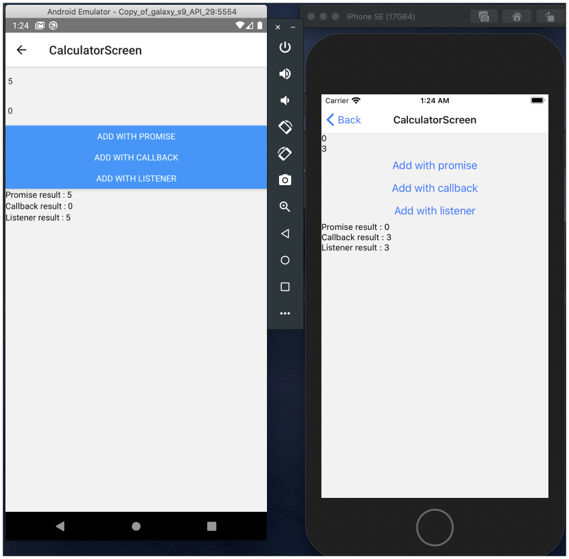
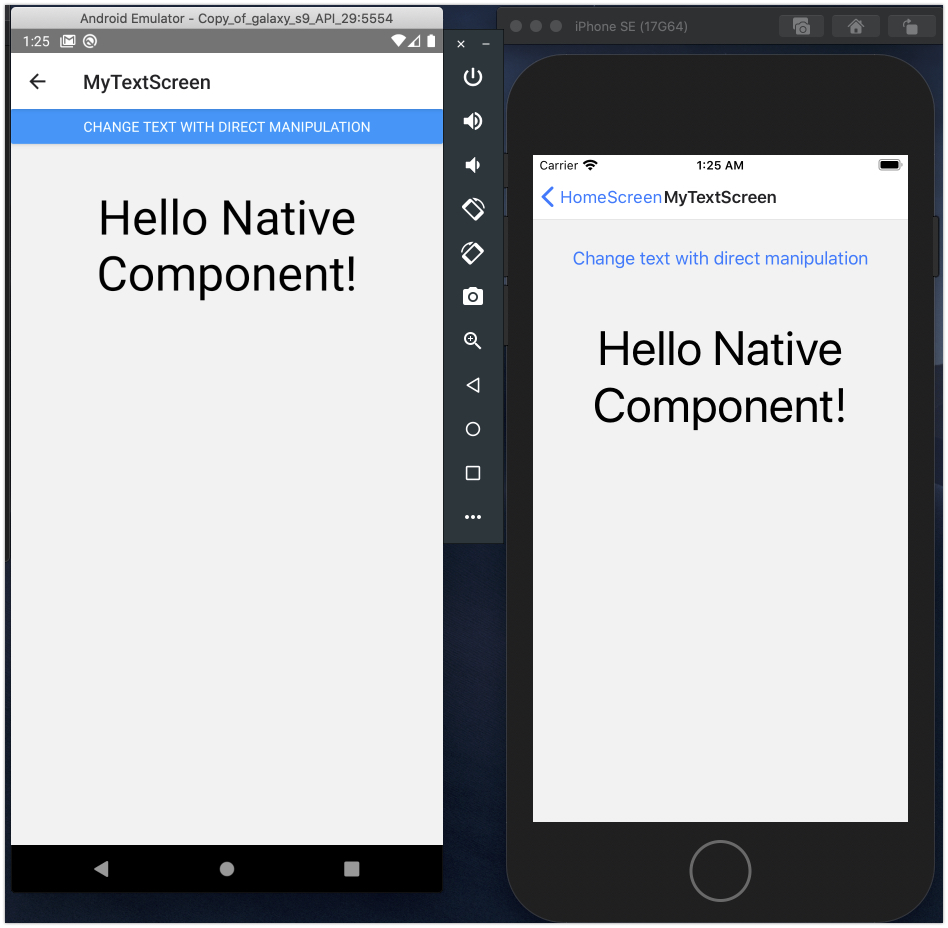
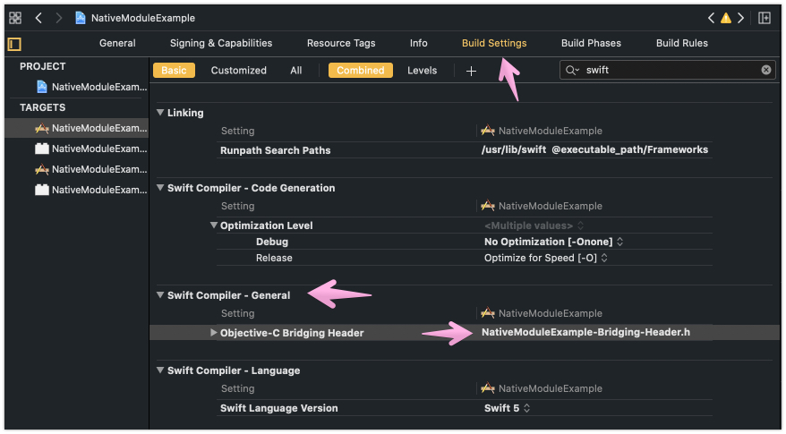

# React Native Native Module, Native Component example
<!-- ALL-CONTRIBUTORS-BADGE:START - Do not remove or modify this section -->
[](#contributors-)
<!-- ALL-CONTRIBUTORS-BADGE:END -->

## Screenshots





## Contents

### [Overview](#overview)

### [0. Basic settings](#0-basic-settings)
- [Android](#android)
- [iOS](#ios)

### [1. Calculator Native Module](#1-native-modulecalculator)
- [React(JavaScript)](#reactjavascript)
- [Android(Kotlin)](#androidkotlin)
- [iOS(Swift, Obj-C)](#iosswift-obj-c)

### [2. MyText Native Component](#2-native-componentmytext)
- [React(JavaScript)](#reactjavascript-1)
- [Android(Kotlin)](#androidkotlin-1)
- [iOS(Swift, Obj-C)](#iosswift-obj-c-1)

### [Contributors](#contributors-)

## Overview

The React Native can use native features with React Native bridge. 
This native feature includes Native modules and Native components. 
The React Native Re-architecture with JSI is ongoing but knowing how to working native modules is valuable at this time.

I created two native modules `Calculator` and `MyText`. `Calculator` is just a simple calculator class and `MyText` is a simple `AppCompatTextView`(Android) and `UILabel`(iOS) wrapper view.

This sample is written with languages `JavaScript`, `Kotlin`(Android), and `Swift`(iOS).

----

## Framework versions

- React: `16.13.1`
- React Native: `0.63.2`

- Android Gradle Plugin: `4.0.1`
- Kotlin: `1.4.0`
- Gradle: `6.2`

- Swift `5`

## 0. Basic settings

### Android

#### 1. Configure Kotlin plugin

*app/build.gradle* (module level)

When you create Kotlin file in React Native project first, `configure Kotlin` button is shown. Click Yes.

```groovy
apply plugin: 'com.android.application'
apply plugin: 'kotlin-android' // add kotlin-android plugin

...
```

*build.gradle* (project level)

```groovy
buildscript {
    ext.kotlin_version = '1.4.0' // this is added automatically
    ext {
        buildToolsVersion = "29.0.2"
        minSdkVersion = 16
        compileSdkVersion = 29
        targetSdkVersion = 29
    }
    repositories {
        google()
        jcenter()
    }
    dependencies {
        classpath("com.android.tools.build:gradle:4.0.1")
        classpath "org.jetbrains.kotlin:kotlin-gradle-plugin:$kotlin_version" // this is added automatically
        // NOTE: Do not place your application dependencies here; they belong
        // in the individual module build.gradle files
    }
    ...
}
```

### iOS

#### 1. Create swift, obj-c bridging header

*{{Your-Project-Name}}-Bridging-Header.h*

When you create Swift file in React Native project first, the bridge header configure dialog is shown. Click Yes.

```h
#import <React/RCTBridgeModule.h>
#import <React/RCTEventEmitter.h>
#import <React/RCTViewManager.h>
#import <React/RCTUIManager.h>
```

You can check your bridging header file path in XCode.



#### 2. Create Objective-C extern bridge file

*NativeModules.m*

```objective-c
#import "{{Your-Project-Name}}-Bridging-Header.h"
#import <React/RCTBridgeModule.h>
#import <React/RCTEventEmitter.h>
#import <React/RCTViewManager.h>
#import <React/RCTUIManager.h>

@interface RCT_EXTERN_MODULE(Calculator, NSObject) // inspect it later!
...
@end
```

----

## 1. Native Module(Calculator)

The `Calculator` module has three different way to add two integer.
- Promise
- Callback
- Event(Native -> JS)

### React(JavaScript)

*Calculator.js*

```jsx
import {NativeModules, NativeEventEmitter} from 'react-native';

const NativeCalculator = NativeModules.Calculator;
const CalculatorEmitter = new NativeEventEmitter(NativeCalculator);

const EventName = NativeCalculator.EVENT_ADD_SUCCESS;

class Calculator {
  native;
  subscription;

  constructor(native) {
    this.native = native;
  }

  async addWithPromise(n1, n2) {
    return await this.native.addWithPromise(n1, n2);
  }

  async addWithCallback(n1, n2, callback) {
    this.native.addWithCallback(n1, n2, callback, (e) => {});
  }

  addWithListener(n1, n2) {
    this.native.addWithListener(n1, n2);
  }

  addResultListener(listener) {
    this.subscription = CalculatorEmitter.addListener(EventName, listener);
  }

  removeResultListener() {
    this.subscription && this.subscription.remove();
  }
}

export default new Calculator(NativeCalculator);

```

### Android(Kotlin)

*Calculator.kt*

```kotlin
class CalculatorPackage : ReactPackage {
    override fun createNativeModules(reactContext: ReactApplicationContext): MutableList<NativeModule> {
        return mutableListOf(Calculator(reactContext))
    }

    override fun createViewManagers(reactContext: ReactApplicationContext): MutableList<ViewManager<View, ReactShadowNode<*>>> {
        return mutableListOf()
    }
}

class Calculator(reactContext: ReactApplicationContext) : ReactContextBaseJavaModule(reactContext) {
    override fun getName() = "Calculator"

    override fun getConstants() = mapOf(
        "EVENT_ADD_SUCCESS" to EVENT_ADD_SUCCESS
    )

    @ReactMethod
    fun addWithPromise(n1: Int, n2: Int, promise: Promise) = promise.resolve(n1 + n2)

    @ReactMethod
    fun addWithCallback(n1: Int, n2: Int, successCallback: Callback, failCallback: Callback) {
        successCallback(n1 + n2)
    }

    @ReactMethod
    fun addWithListener(n1: Int, n2: Int) =
        reactApplicationContext.getJSModule(DeviceEventManagerModule.RCTDeviceEventEmitter::class.java)
            .emit(EVENT_ADD_SUCCESS, n1 + n2)

    companion object {
        const val EVENT_ADD_SUCCESS = "event_add_success"
    }
}
```

*MainApplication.kt*

Add our `ReactPackage` in `getPackages()` method.

```kotlin
class MainApplication : Application(), ReactApplication {
    override fun getReactNativeHost() = object : ReactNativeHost(this) {
        override fun getUseDeveloperSupport() = BuildConfig.DEBUG

        override fun getPackages() = PackageList(this).packages.apply {
            add(MyTextPackage())
            add(CalculatorPackage()) // Here
        }

        override fun getJSMainModuleName() = "index"
    }
    ...
}
```

### iOS(Swift, Obj-C)

*Calculator.swift*

```swift
import Foundation

@objc(Calculator)
class Calculator: RCTEventEmitter{
  static let EVENT_ADD_SUCCESS = "event_add_success"
  
  override func supportedEvents() -> [String]! {
    return [Calculator.EVENT_ADD_SUCCESS]
  }
  
  @objc
  override func constantsToExport() -> [AnyHashable: Any]!{
    return ["EVENT_ADD_SUCCESS": Calculator.EVENT_ADD_SUCCESS]
  }
  
  @objc
  static override func requiresMainQueueSetup() -> Bool{
    return true;
  }
  
  @objc
  func addWithPromise(_ first: Int, n2 second: Int, resolve: RCTPromiseResolveBlock, reject: RCTPromiseRejectBlock){
    resolve(first + second)
  }
  
  @objc
  func addWithCallback(_ first: Int, n2 second: Int, onSuccess: RCTResponseSenderBlock, onFail: RCTResponseSenderBlock){
    onSuccess([first + second])
  }
  
  @objc
  func addWithListener(_ first: Int, n2 second: Int){
    self.sendEvent(withName: Calculator.EVENT_ADD_SUCCESS, body: first + second)
  }
}

```

*NativeModules.m*

Add your module in Objective-C extern bridge file.

```objective-c
#import "{{Your-Project-Name}}-Bridging-Header.h"
#import <React/RCTBridgeModule.h>
#import <React/RCTEventEmitter.h>
#import <React/RCTViewManager.h>
#import <React/RCTUIManager.h>

@interface RCT_EXTERN_MODULE(Calculator, NSObject)
RCT_EXTERN_METHOD(
                  addWithPromise: (int)first
                  n2: (int)second
                  resolve: (RCTPromiseResolveBlock)resolve
                  reject: (RCTPromiseRejectBlock)reject
                  )

RCT_EXTERN_METHOD(
                  addWithCallback: (int)first
                  n2: (int)second
                  onSuccess: (RCTResponseSenderBlock)onSuccess
                  onFail: (RCTResponseSenderBlock)onFail
                  )

RCT_EXTERN_METHOD(
                  addWithListener: (int)first
                  n2: (int)second
                  )
@end
```

----

## 2. Native Component(MyText)

The `MyText` native component has three features.
- pass `text` with prop
- subscribe event from native component when text is changed with `onTextChanged` prop
- manipluate directly with `ref`

### React(JavaScript)

*MyText.js*

```jsx
import React, {useRef, useImperativeHandle, useCallback} from 'react';
import {
  requireNativeComponent,
  UIManager,
  findNodeHandle,
  Platform,
} from 'react-native';

const COMPONENT_NAME = Platform.OS === 'ios' ? 'MyTextView' : 'MyText';
const NativeComponent = requireNativeComponent(COMPONENT_NAME);
const NativeViewManager = UIManager[COMPONENT_NAME];

const PROP_TEXT = 'textProp';
const COMMAND_SET_TEXT = 'setText';
const EVENT_ON_TEXT_CHANGED = 'onTextChanged';

const MyText = ({text, style, onTextChanged}, ref) => {
  const nativeRef = useRef(null);

  const manipulateTextWithUIManager = useCallback((text) => {
    UIManager.dispatchViewManagerCommand(
      findNodeHandle(nativeRef.current),
      NativeViewManager.Commands[COMMAND_SET_TEXT],
      [text],
    );
  }, []);

  useImperativeHandle(
    ref,
    () => ({
      setText: manipulateTextWithUIManager,
    }),
    [manipulateTextWithUIManager],
  );

  return (
    <NativeComponent
      ref={nativeRef}
      style={[{height: 200}, style]}
      {...{
        [PROP_TEXT]: text,
        [EVENT_ON_TEXT_CHANGED]: ({nativeEvent: {text}}) => onTextChanged(text),
      }}
    />
  );
};

export default React.forwardRef(MyText);

```

### Android(Kotlin)

*MyText.kt*

```kotlin
class MyTextPackage : ReactPackage {
    override fun createNativeModules(reactContext: ReactApplicationContext): MutableList<NativeModule> {
        return mutableListOf()
    }


    override fun createViewManagers(reactContext: ReactApplicationContext): List<ViewManager<*, *>> {
        return mutableListOf(MyTextManager())
    }
}

class MyTextManager : SimpleViewManager<MyText>() {
    override fun getName() = "MyText"

    override fun createViewInstance(reactContext: ThemedReactContext) = MyText(reactContext)

    // region Direct manipulation with ref
    override fun getCommandsMap(): MutableMap<String, Int> {
        return mutableMapOf(COMMAND_SET_TEXT to COMMAND_SET_TEXT_ID)
    }

    override fun receiveCommand(root: MyText, commandId: Int, args: ReadableArray?) {
        if (commandId == COMMAND_SET_TEXT_ID) root.textProp = args!!.getString(0)!!
    }
    // endregion

    /** props of custom native component */
    @ReactProp(name = "textProp")
    fun MyText.setText(value: String = "") {
        textProp = value
    }


    // region Native -> JS prop event
    override fun getExportedCustomDirectEventTypeConstants(): Map<String?, Any?>? {
        return createExportedCustomDirectEventTypeConstants()
    }

    private fun createExportedCustomDirectEventTypeConstants(): Map<String?, Any?>? {
        return MapBuilder.builder<String?, Any?>()
            .put(EVENT_ON_TEXT_CHANGED, MapBuilder.of("registrationName", EVENT_ON_TEXT_CHANGED)).build()
    }
    // endregion


    companion object {
        private const val COMMAND_SET_TEXT = "setText"
        private const val COMMAND_SET_TEXT_ID = 1

        const val EVENT_ON_TEXT_CHANGED = "onTextChanged"
    }
}

class MyText @JvmOverloads constructor(context: Context, attrs: AttributeSet? = null) :
    AppCompatTextView(context, attrs) {

    init {
        textSize = 48f
        gravity = Gravity.CENTER
    }

    var textProp = ""
        set(value) {
            field = value
            text = value
            emitTextChangedEvent()
        }

    private fun emitTextChangedEvent() {
        val reactContext = context as ReactContext
        reactContext.getJSModule(RCTEventEmitter::class.java)
            .receiveEvent(id, MyTextManager.EVENT_ON_TEXT_CHANGED, Arguments.createMap().apply {
                putString("text", textProp)
            })
    }
}
```

### iOS(Swift, Obj-C)

*MyText.swift*

```swift
import UIKit

@objc(MyTextViewManager)
class MyTextViewManager: RCTViewManager{
  override func view() -> UIView! {
    return MyTextView()
  }
  
  override static func requiresMainQueueSetup() -> Bool {
    return true
  }
  
  override func constantsToExport() -> [AnyHashable : Any]! {
    return [:]
  }
  
  @objc
  func setText(_ node: NSNumber, text: String){
    DispatchQueue.main.async {
      let component = self.bridge.uiManager.view(forReactTag: node) as! MyTextView
      component.textProp = text
    }
  }
}

fileprivate class MyTextView: UILabel {
  @objc
  var textProp: String = "" {
    didSet {
      self.text = self.textProp
      self.onTextChanged?(["text": self.textProp])
    }
  }
  
  @objc
  var onTextChanged: RCTDirectEventBlock?

  required init?(coder: NSCoder) {
    fatalError("Not Implemented")
  }
  
  override init(frame: CGRect) {
    super.init(frame: frame)
    
    self.font = UIFont.systemFont(ofSize: 48)
    self.textAlignment = .center
    self.numberOfLines = 0
  }
}

```

*NativeModules.m*

Add your module in Objective-C extern bridge file.

```objective-c
#import "{{Your-Project-Name}}-Bridging-Header.h"
#import <React/RCTBridgeModule.h>
#import <React/RCTEventEmitter.h>
#import <React/RCTViewManager.h>
#import <React/RCTUIManager.h>

@interface RCT_EXTERN_MODULE(MyTextViewManager, RCTViewManager)
RCT_EXPORT_VIEW_PROPERTY(textProp, NSString)

RCT_EXPORT_VIEW_PROPERTY(onTextChanged, RCTDirectEventBlock)

RCT_EXTERN_METHOD(
                  setText: (nonnull NSNumber *)node
                  text: (NSString)text
                  )
@end

```

## Contributors ✨

Thanks goes to these wonderful people ([emoji key](https://allcontributors.org/docs/en/emoji-key)):

<!-- ALL-CONTRIBUTORS-LIST:START - Do not remove or modify this section -->
<!-- prettier-ignore-start -->
<!-- markdownlint-disable -->
<table>
  <tr>
    <td align="center"><a href="https://www.mjstudio.net/"><br /><sub><b>MJ Studio</b></sub></a><br /><a href="https://github.com/mym0404/react-native-native-module-example/commits?author=mym0404" title="Code">💻</a> <a href="https://github.com/mym0404/react-native-native-module-example/commits?author=mym0404" title="Documentation">📖</a> <a href="#example-mym0404" title="Examples">💡</a></td>
  </tr>
</table>

<!-- markdownlint-enable -->
<!-- prettier-ignore-end -->
<!-- ALL-CONTRIBUTORS-LIST:END -->

This project follows the [all-contributors](https://github.com/all-contributors/all-contributors) specification. Contributions of any kind welcome!
